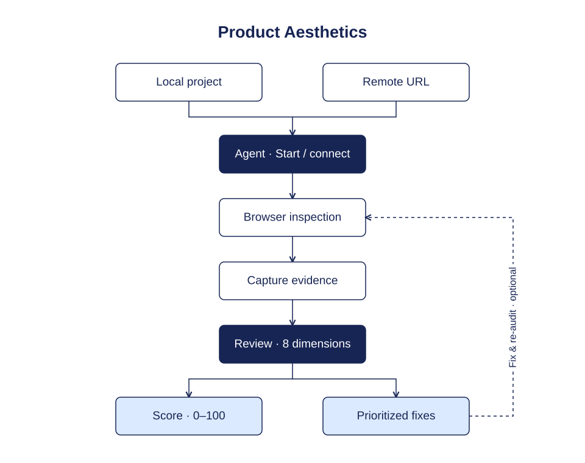
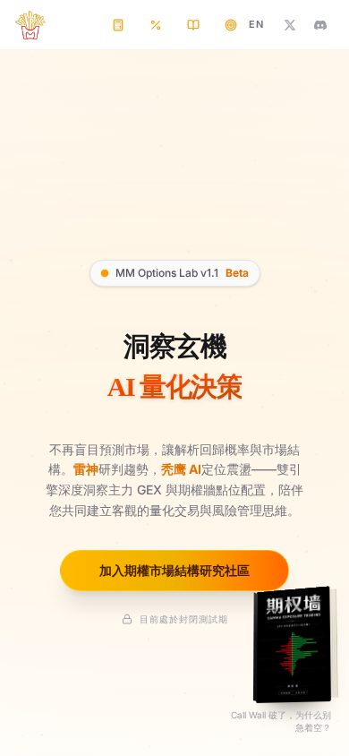
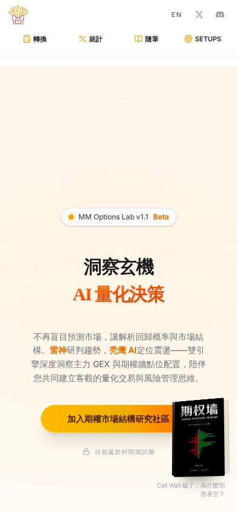
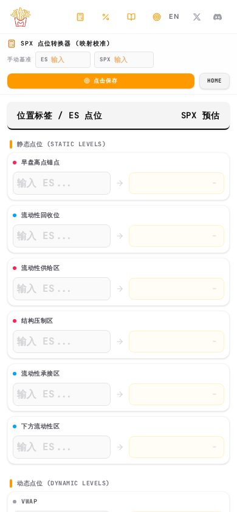
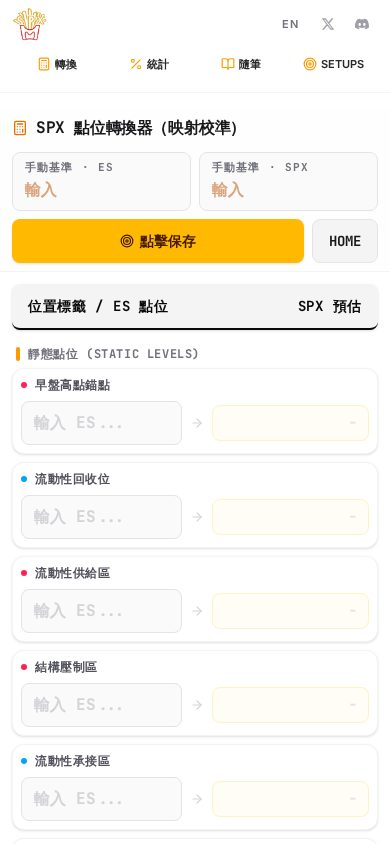
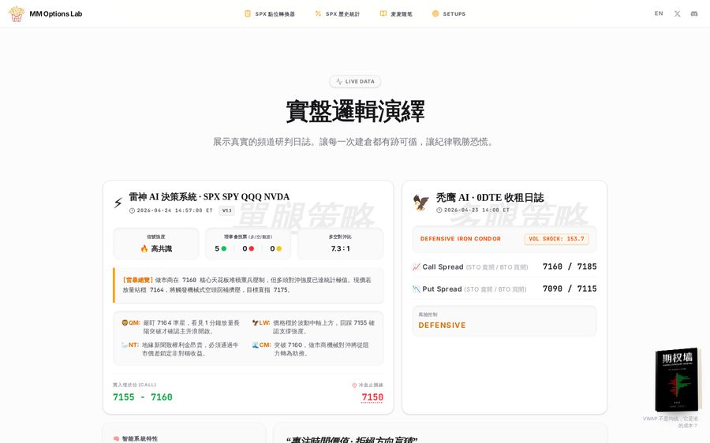
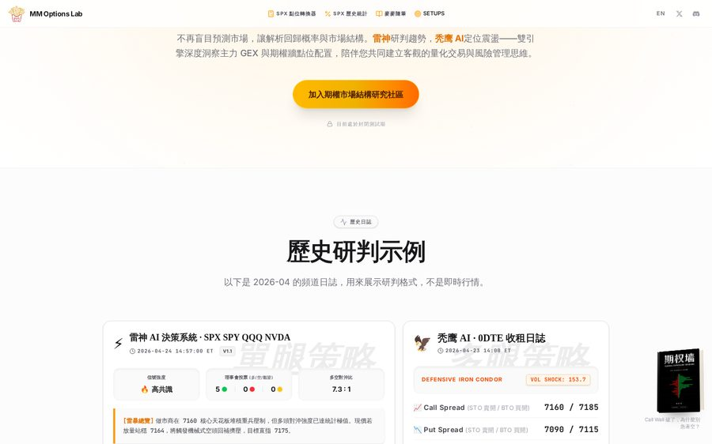

<h1 align="center">Product Aesthetics</h1>
<p align="center"><strong>Ship the product. Let your agent inspect the experience.</strong></p>
<p align="center">Browser-driven aesthetics audits for Codex &amp; Claude Code.<br/>0–100 scores · Evidence-backed issues · Prioritized fixes</p>
<p align="center"><a href="#quick-start">Quick start</a> · <a href="#how-it-works">Workflow</a> · <a href="#scoring">Scoring</a> · <a href="#field-test">Field test</a> · <a href="#requirements">Requirements</a></p>


## Your agent does the inspection

Give your agent a local project or a running URL. It starts or connects to the app, opens browser tools, inspects the experience, captures screenshots, and returns an actionable audit. **No manual screenshots required in the normal workflow.**

- Inspect representative pages, desktop/mobile layouts, and the primary journey.
- Check visible hierarchy, typography, component rules, feedback, and brand coherence.
- Score eight dimensions with explicit evidence and disclose untested areas.
- Deliver the highest-value fixes with priorities, estimated effort, and acceptance criteria.
- Implement changes when requested, then re-audit the same scope.

## Quick start

Clone this repository:

```bash
git clone https://github.com/kain26/product-aesthetics-skill.git
```

From the **product project you want to inspect**, copy the skill directory. Replace the source path below with your clone's actual location. Preserve any existing customized installation.

### Codex

```bash
mkdir -p .agents/skills
cp -R /path/to/product-aesthetics-skill/skills/product-aesthetics .agents/skills/
```

```text
$product-aesthetics Audit this project. Start the existing dev setup,
use browser tools to inspect desktop and mobile, test the main journey,
and capture screenshots yourself. Give a 0–100 score and prioritized
fixes with acceptance criteria. Audit only; do not modify the product.
```

For a personal installation, copy the same directory to `~/.agents/skills/`.

### Claude Code

```bash
mkdir -p .claude/skills
cp -R /path/to/product-aesthetics-skill/skills/product-aesthetics .claude/skills/
```

```text
/product-aesthetics Audit this project. Start the existing dev setup,
use browser tools to inspect desktop and mobile, test the main journey,
and capture screenshots yourself. Give a 0–100 score and prioritized
fixes with acceptance criteria. Audit only; do not modify the product.
```

For a personal installation, copy the same directory to `~/.claude/skills/`.

Both agents use the same `SKILL.md` and references. `agents/openai.yaml` provides Codex display metadata. Official installation guidance: [Codex](https://developers.openai.com/codex/skills) · [Claude Code](https://code.claude.com/docs/en/skills).

## How it works



This is a Markdown Agent Skill: a reusable inspection procedure, rubric, and reporting contract loaded by your agent. The host supplies the language model, terminal, browser control, and screenshot inspection capabilities.

1. **Start or connect.** Read the existing project setup and reuse or start its dev server; connect directly to a running remote URL.
2. **Inspect.** Navigate representative pages, test the primary journey, and examine intended screen sizes and reachable states.
3. **Capture evidence.** Take and inspect screenshots; record route, viewport, state, and concrete observations.
4. **Evaluate.** Judge function, visual order, interaction, and brand together using fixed scoring anchors.
5. **Deliver.** Connect each problem to a location, user impact, concrete change, and acceptance check.
6. **Recheck.** After requested changes, repeat the same pages, viewports, and states.

The agent owns evidence collection. If startup, tools, or access are blocked, it reports the specific blocker and asks for the missing prerequisite rather than making manual screenshots the default.

## Scoring

### Eight dimensions · 100 points

| Dimension | Weight | Evaluate |
|---|---:|---|
| Purpose & task clarity | 15 | Clear purpose and next actions |
| Hierarchy & composition | 20 | Reading order, grouping, density, spacing |
| Typography & readability | 15 | Type roles, scale, reading comfort |
| Color & material logic | 10 | Semantic color, contrast, surface treatments |
| Component consistency | 15 | Stable rules within and across screens |
| Interaction & feedback | 10 | Focus, transitions, loading/error/success states |
| Responsive & inclusive presentation | 10 | Intended sizes and inspected access paths |
| Brand coherence | 5 | A visual language appropriate to the product |

Each observed dimension receives an integer rating from 0 to 5:
**0** fundamental breakdown · **1** widespread severe defects · **2** repeated inconsistency · **3** competent but unfinished · **4** strong with localized gaps · **5** exceptional coherence supported by evidence.

```text
Dimension contribution = weight × rating / 5
Score = round-half-up(100 × sum(contributions) / sum(observed weights))
Coverage = sum(observed weights) / 100
```

Unobserved dimensions are **U**, not zero. For example, observed weight 80 and contribution 50 yield a provisional score of **63/100**, with **80% rubric coverage**. Coverage does not measure the percentage of all product behavior tested.

| Score | Interpretation |
|---|---|
| 90–100 | Exceptional coherence |
| 80–89 | Polished with localized gaps |
| 70–79 | Coherent, visibly unfinished |
| 60–69 | Substantial inconsistency |
| 40–59 | Fragmented experience |
| 0–39 | Fundamental breakdown |

Every deduction needs evidence. Density can suit a trading terminal; whitespace can suit a reading product. Minimalism, gradients, glass, and dark mode never earn automatic bonuses or penalties.

## What you get

| Output | Contents |
|---|---|
| Scorecard | Overall score, dimension ratings, coverage, confidence |
| Diagnosis | The main pattern making the experience feel unfinished |
| Keep | 1–3 verified strengths |
| Fix first | 3–5 key issues, locations, impact, priorities, effort |
| Verification | Acceptance criteria for each proposed change |
| Agent handoff | A cohesive implementation prompt grounded in findings |

**P0:** observed primary-task blocker or unreadable essential content. **P1:** repeated, high-impact hierarchy/system issues. **P2:** localized polish. Optional taste preferences stay separate.

## More ways to use it

**Deployed product**

```text
Use product-aesthetics to audit https://your-product.example.
Use browser tools, inspect representative pages and the primary journey,
and capture the evidence yourself. Explain what to fix first and why.
```

**Implement and re-audit**

```text
Implement the P1 fixes from the audit. Preserve existing functionality
and brand direction. Recheck the same pages, viewports, and states
with browser tools. Report verified improvements and remaining issues.
```

**Compare versions**

```text
Use product-aesthetics to compare these two versions with the same
rubric, routes, viewports, and states. Explain comparability limits
if evidence scope differs. Do not predict an unverified future score.
```

## Field test

One public product, [myspx.trade](https://myspx.trade) (MM Options Lab), was audited with this skill on 2026-10-05, then changed only where the audit named a fix. Rubric v1.0. Viewports 1440×900 and 390×844. Routes `/`, `/converter`, `/stats`, `/blog`. The agent opened the site, took the screenshots, and did not ask for any.

**Before: 65/100** (60–69, substantial inconsistency). Confidence medium. The homepage already read as one research desk. The working tool did not.

What the skill actually found, and what was measured rather than guessed:

| Priority | Where | Evidence | Fix that shipped |
|---|---|---|---|
| P1 | Mobile converter | Baseline inputs 56×17px, 11px type. Save control 26px tall, 9px type | Both baselines are 59px tall with 16px numerals. Save is 44px tall |
| P1 | Converter | Two “盘前分析” cards repeated the same empty state | One card remains. Zoom and download act on that card |
| P1 | Homepage “实盘” block | Badge read LIVE DATA above a log dated 2026-04-24. Review date was 2026-10-05 | Badge and heading now say 歷史日誌 / 歷史研判示例 |
| P1 | 390px nav, site chrome | Tool names collapsed to unlabeled icons. Interface mixed Traditional and Simplified Chinese | Short names stay visible: 轉換 / 統計 / 隨筆 / SETUPS. Chrome on these four pages is Traditional. Article bodies were left alone |
| P2 | Keyboard | Focused control reported `outline-style: none` | Tab shows a 2px solid ring |

The homepage hero was not redesigned. The skill’s handoff said not to replace a working claim and button with a new visual language.

**After the same checks: 80/100** (80–89, polished with localized gaps). `/` and `/converter` were opened again at both widths. `/stats` and `/blog` only had interface-copy edits and were not re-screenshotted, so the 15-point rise is comparable on the failing screens, not a claim that every untouched pixel was re-scored.

| Dimension | Weight | Before | After |
|---|---:|---:|---:|
| Purpose and task clarity | 15 | 3 | 4 |
| Visual hierarchy | 20 | 4 | 4 |
| Typography | 15 | 3 | 4 |
| Color and material | 10 | 4 | 4 |
| Component consistency | 15 | 3 | 4 |
| Interaction and feedback | 10 | 3 | 4 |
| Responsive and inclusive | 10 | 2 | 4 |
| Brand coherence | 5 | 4 | 4 |

Contribution sum 65 → 80. Observed weight 100 both times. No dimension was scored 5. The April log is still historical; it is just no longer labeled live. The converter title still contains the internal token `SPESMAIN`.

### Mobile nav

The names of the tools were the product. At 390px they had disappeared.

| Before | After |
|---|---|
|  |  |

### Converter, phone width

This is the screen where the audit refused to call the product finished. Same route, same width.

| Before | After |
|---|---|
|  |  |

### One ladder, not two

The first converter viewport already showed a single dark card, so a side-by-side of that crop would hide the bug. The page text contained **two** “盤前分析” blocks: the card on screen, plus a second export clone kept in the document at `opacity: 0`. That clone was still in the accessibility text and made the mobile page continue into a copy of the same empty state. After the change, zoom and download use the visible card, and the route contains one “盤前分析”.

### A status color has to match the date

The April 2026 log stayed. The label stopped calling it current.

| Before | After |
|---|---|
|  |  |

After screenshots are from the merged build (`kain26/myspx`, 2026-10-05). When they were taken, the production HTML still pointed at the previous bundle, so these frames are the fixed source running locally, not a claim that the live host had already rolled out.

### What this shows about the skill

It is useful when a product already has a point of view and the remaining work is specific. The audit did not say “make it more premium.” It separated a strong homepage from four repeated failures, attached each one to a screen and a measurement, and wrote an acceptance check another coding agent could implement without inventing a new brand.

It is not a conversion model and not a launch sign-off. 80 still means localized gaps. A later audit with a different route list should not be subtracted from 65 as if the scopes were identical.

## Requirements

Your agent needs a permitted runtime for local startup, browser tools, and screenshot inspection. This skill defines their use; it does not bundle a browser, provision hosting, or provide credentials. Dependency setup follows the project and host's authorization rules.

A full product score requires observations for every dimension, a tested primary journey, and the intended platform scope. Partial evidence produces an explicitly scoped provisional score. If no rendered evidence can be obtained after attempting startup, the agent reports implementation risks without inventing a visual score. User-supplied screenshots remain an optional, explicitly chosen fallback.

Scores are structured judgments, not objective measurements, conversion predictions, or launch certification. A high aesthetic score can coexist with a P0 interaction defect.

## Resources

- [Skill instructions](skills/product-aesthetics/SKILL.md)
- [Rubric v1.0](skills/product-aesthetics/references/rubric.md)
- [Report format](skills/product-aesthetics/references/report.md)
- [SVG workflow](assets/workflow.svg)

- [Field test screenshots](assets/case-myspx/)

## Validation status

Skill structure has been validated. An earlier source-only scenario was independently checked to ensure no visual score was invented. On 2026-10-05 the browser path was used end to end on myspx.trade: inspect, score, implement the named fixes, and re-open the same routes. See [Field test](#field-test). That run has not been repeated in Claude Code, and one product does not calibrate the rubric for every category. Shared format compatibility does not guarantee identical model scores.
